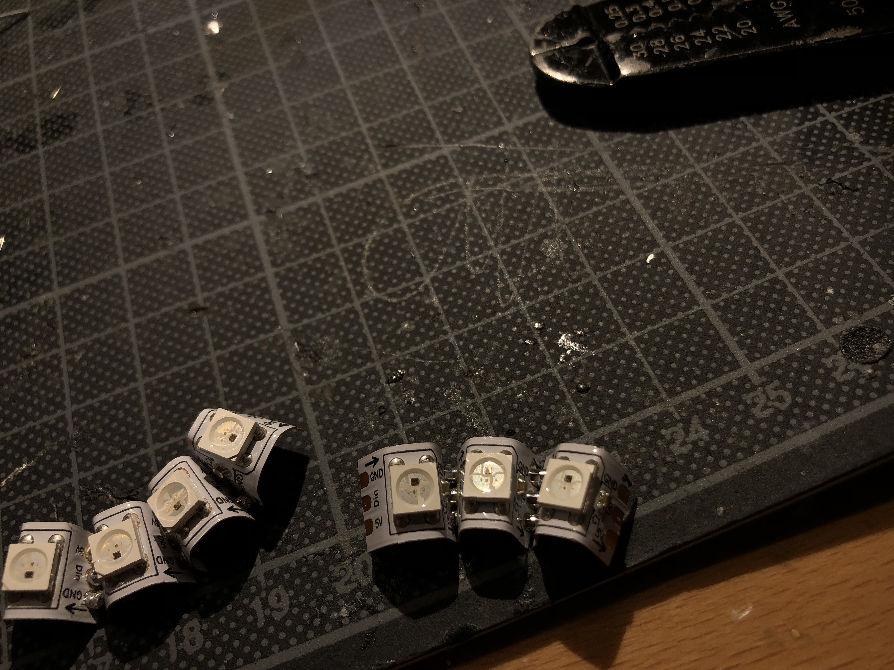

The initial prototyped model had all the right aspects but not the right features. So, I decided to alter the designs. I started building from scratch trying to mimick a balloon shaped body to make it more rounder and hence, cuter.  

### Neopixel Ring

### Conveyor Belt

The conveyor belt was made out of sturdy cardboard.

From the side:

Final look:

