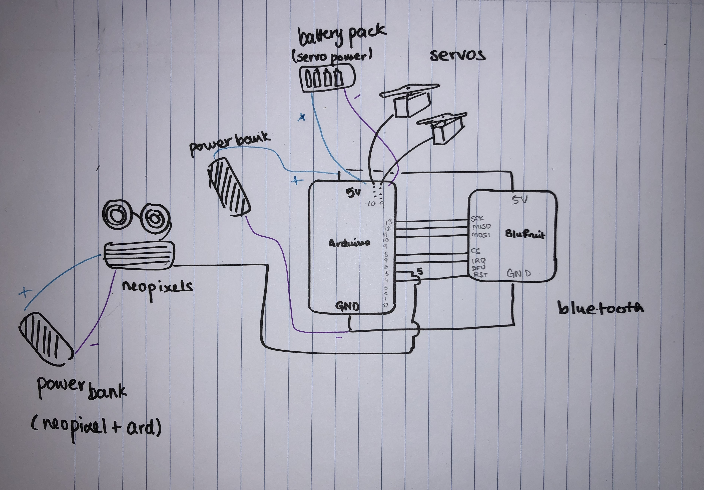
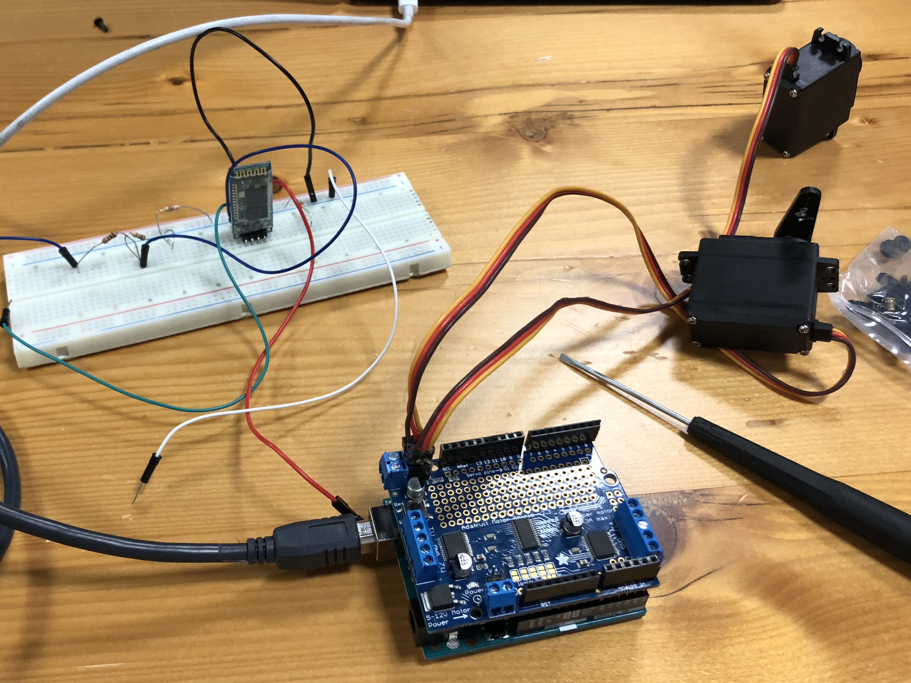
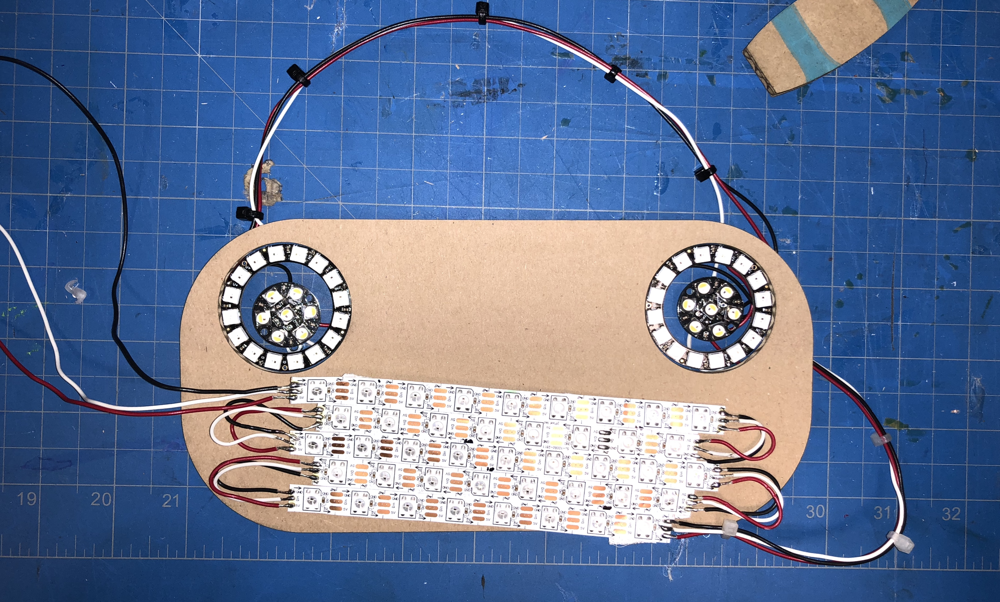
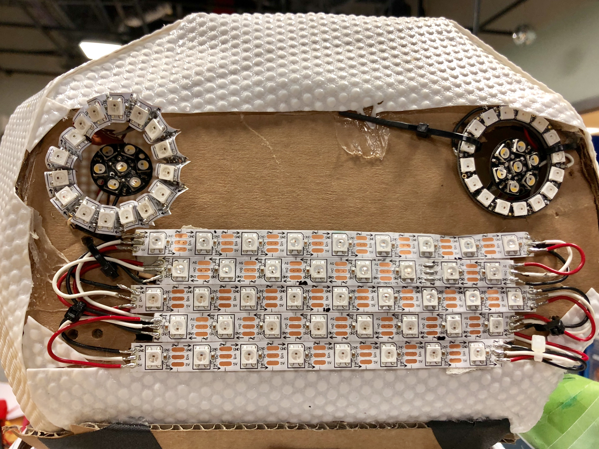
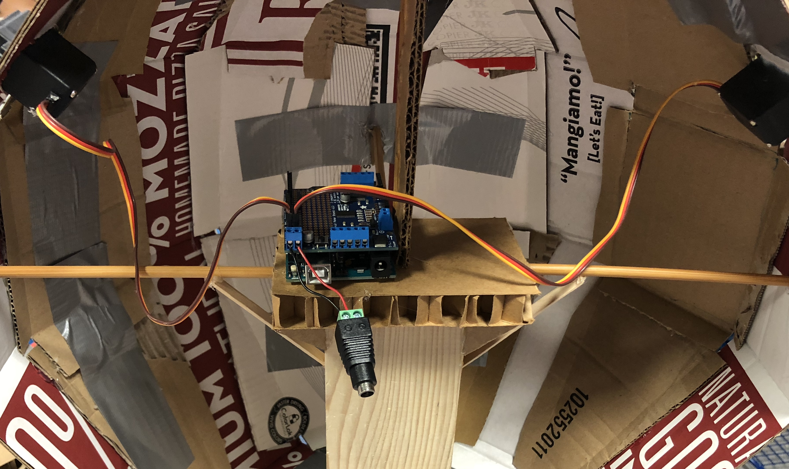

# Manufacturing Consciousness
## Praggya Jeyakumar and Maxin Blinov
#### Performing Robots: IM-UH2117 Interactive Media Elective

**Link to performance video:**
['Manufacturing Consciousness' Video](https://drive.google.com/file/d/1gbxmSE6PLL_eIsrFjue3BnJgBO-sdiqA/view?usp=sharing)

### Overall project concept and description
[Inspirations, Ideas and Concepts](https://github.com/PraggyaJ/Performing-Robots/blob/master/FinalProject/Ideation/inspirations%26ideas%26concepts.md)

[Entire final building process](https://github.com/PraggyaJ/Performing-Robots/blob/master/FinalProject/Building/Building_Progress.md)

### System diagram of the hardware

### List of important parts (don’t include wires, resistors, etc.)
 - Arduino Uno
 - Adafruit Bluefruit LE UART Friend - Bluetooth Low Energy (BLE)
 - 2 high torque servos
 - 1 Neopixel strip
 - 1 16-LED Neopixel Ring
 - 2 Neopixel jewels
 - 1 powerbank
### Pictures of the electronics and props
Bluetooth breadeboarded:

Intial neopixels on face:

Neopixels on face after damaging neopixel ring and making a new one:

Servos inside body:

### Code (with good comments, good variable names, proper indentation, etc.)
[Code for the small robot](https://github.com/PraggyaJ/Performing-Robots/tree/master/FinalProject/Code(robot_being_built))

### Discuss 3-5 problems you ran into and how you resolved them or worked around them
#### Attachable hands
#### Damaged eye Neopixel ring
#### Coding for a Neopixel Jewel
#### Performance details
