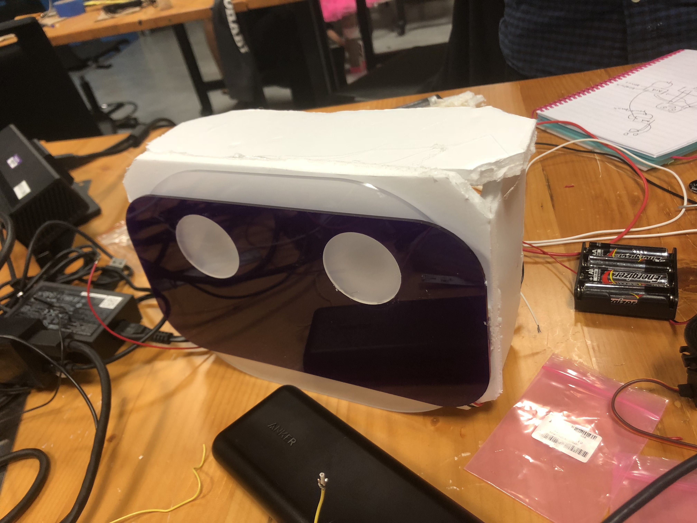
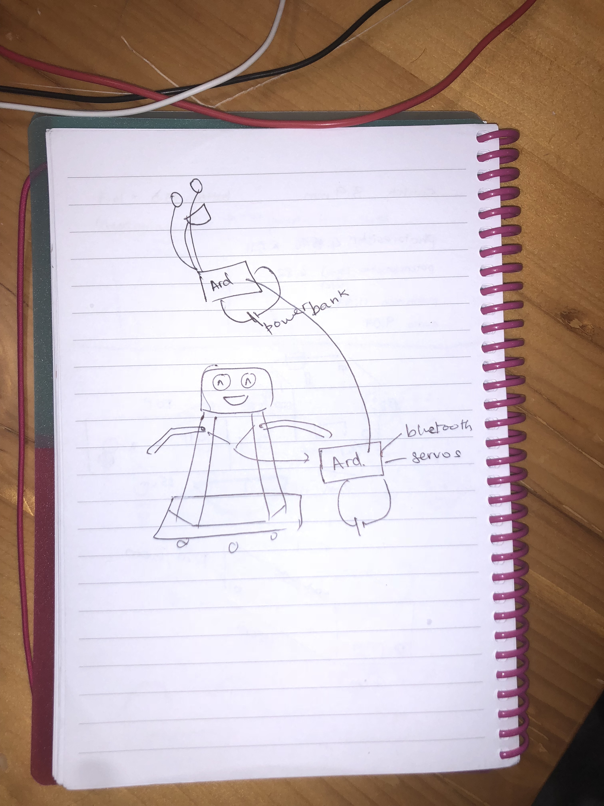
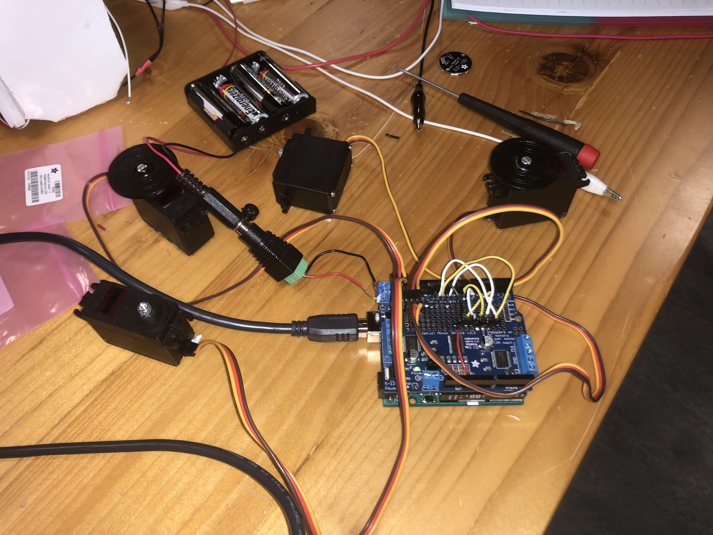
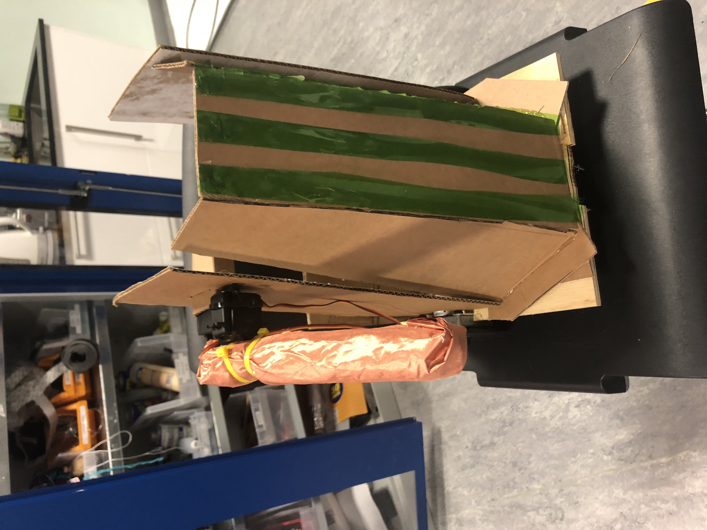

## Features Of our robot: PMP3000 (Praggya/Paulin/Max)
Our robot will be able to move on a track that is either drawn or put together (like puzzle pieces) by the audience. A kinect will track the audience member’s hand movement and the robot will mimic that and change facial expressions accordingly (all while following the track).

# Process

We divided up the tasks and proceeded on our own pace. Max worked on the base and getting the robot to follow the track . Paulin worked on getting the audience to control the hands (bluetooth) and the kinect. I worked on the face, facial expressions and the constructions of the hands and body.
# Base:
Video for base: https://youtu.be/nnmAvub0XbM

# Face:

